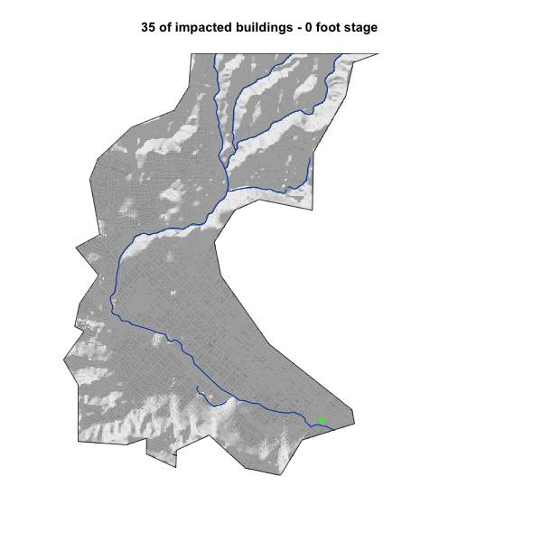

```{r setup, include=FALSE}
knitr::opts_chunk$set(warning = FALSE, message = FALSE, out.width = "75%", fig.align = 'center')
```

# Libraries
```{r}
library(sf)        # vector manipulation
library(raster)    # raster manipulation
library(fasterize) # "faster" raster
library(whitebox)  # terrain analysis

# Data libraries
library(osmdata)   # OSM API
library(elevatr)   # Elevation  Web Tiles
library(climateR) 
```

# Reading in Data
```{r}
basin = read_sf("https://labs.waterdata.usgs.gov/api/nldi/linked-data/nwissite/USGS-11119750/basin") 

basin_elev = get_elev_raster(basin, z=13) %>% 
  crop(basin) %>% 
  mask(basin)
  
basin_ft = basin_elev*3.281

writeRaster(basin_ft, "../data/basin_elev_ft.tif", overwrite = TRUE)
```

# Buildings and Water Data
```{r}
buildings = add_osm_feature(opq(basin), key="building") %>% osmdata_sf()
streams = add_osm_feature(opq(basin), key = "waterway", value="stream") %>%  osmdata_sf()

building_cent = st_centroid(buildings$osm_polygons) %>% st_intersection(basin)

railway = dplyr::filter(building_cent, amenity == "railway")

river = st_intersection(streams$osm_lines, basin)
```

# Terrain Analysis
```{r}
wbt_hillshade("../data/basin_elev_ft.tif", "../data/basin_hillshade.tif")

hillshade_rast = raster("../data/basin_hillshade.tif")

plot(hillshade_rast, col = gray.colors(256, alpha = .5), legend = FALSE, axes = FALSE, box = FALSE)
plot(basin$geometry, add=TRUE)
plot(river$geometry, add=TRUE, col="navyblue")
```

# HAND Creation
```{r}
HAND = st_transform(river, 5070) %>% 
  st_buffer(10) %>% 
  st_transform(crs(basin_ft)) %>% 
  fasterize(basin_ft)

writeRaster(HAND, "../data/hand_rast.tif", overwrite=TRUE)
```

# Hydrologically Corrected Surface
```{r}
wbt_breach_depressions("../data/basin_elev_ft.tif","../data/wbt_b_d.tif")
```

# HAND Raster
```{r}
wbt_elevation_above_stream("../data/wbt_b_d.tif", "../data/hand_rast.tif", "../data/hand_raster.tif")
```

# orrecting to local Reference Datum
```{r}
h = raster("../data/hand_raster.tif")
r = raster("../data/hand_rast.tif")

h = h + 3.69

h[r == 1] = 0

writeRaster(h, "../data/hand_correction.tif", overwrite = TRUE)
```

# 2017 Flood Impact Assesment
```{r}
hc = raster("../data/hand_correction.tif")
tmp = hc

tmp[tmp >= 10.02] = NA

plot(hillshade_rast, col = gray.colors(256, alpha = .5), legend = FALSE, axes = FALSE, box = FALSE)
plot(tmp, col = rev(blues9), add = TRUE, legend = FALSE, axes = FALSE, box = FALSE)
plot(railway$geometry, col = "green", pch = 16, cex=1, add=TRUE)
plot(river$geometry, add=TRUE, col="navyblue")
plot(basin$geometry, add=TRUE)
```
Does that map look accurate?
Yes, the lines and shading all overlay accordingly along with the flood area.

# Adding Buildings and color scheme
```{r}
col = ifelse(!is.na(raster::extract(tmp, building_cent)), "red", "black")
plot(hillshade_rast, col = gray.colors(256, alpha = .5), legend = FALSE, axes = FALSE, box = FALSE, main = paste0(sum(col == "red"), " of impacted buildings"))
plot(tmp, col = rev(blues9), add = TRUE, legend = FALSE, axes = FALSE, box = FALSE)
plot(railway$geometry, col = "green", pch = 16, cex=1, add=TRUE)
plot(river$geometry, add=TRUE, col="navyblue")
plot(basin$geometry, add=TRUE)
plot(building_cent$geometry, add = TRUE, col = col, pch = 16, cex=0.08)
```

# Gif Creation - Extra Credit
```{r}
sb = AOI::aoi_get("Santa Barbara")

basin_sb = st_intersection(basin, sb)
h2 = crop(hc, sb)
hill = crop(hillshade_rast, sb)
```

```{r, eval=FALSE}
gifski::save_gif({
  for(i in 0:20) {
    tmp2 = h2
    tmp2[tmp2 > i] = NA
    cols = ifelse(!is.na(raster::extract(tmp2, building_cent)), "red", "black")
    plot(hill, col = gray.colors(256, alpha = .5), legend = FALSE, axes = FALSE, box = FALSE, main = paste0(sum(cols == "red"), " of impacted buildings - ", i, " foot stage"))
    plot(building_cent$geometry, add = TRUE, col = cols, pch = 16, cex=0.08)
    plot(tmp2, col = rev(blues9), add = TRUE, legend = FALSE, axes = FALSE, box = FALSE)
    plot(railway$geometry, col = "green", pch = 16, cex=1, add=TRUE)
    plot(river$geometry, add=TRUE, col="navyblue")
    plot(basin_sb$geometry, add=TRUE)
  }
}, gif_file = "../data/flood.gif",
   width = 600, height = 600, 
   delay = .7, loop = TRUE)
```




